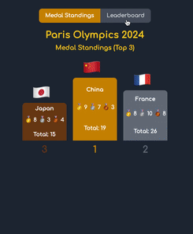

# olympics-tracker-extension

The Paris Olympics 2024 Stats extension provides users with real-time medal standings and a detailed breakdown of medals won by each country in various sports disciplines during the Paris Summer Olympics 2024. Users can pin their favorite countries for easy tracking, search and filter countries, and enjoy a user-friendly interface.

## Features

- Real-time Medal Standings
- Pinned Favorites
- Collapsible Sections
- Discipline Details
- Persistent Favorites
- Tooltips
- Search and Filter

### Preview



### Installation

1. Clone the repository

2. Install the dependency

   ```sh
   npm install
   ```

3. Build the Project

   ```sh
   npm run build
   ```

### Loading the Extension in Chrome

- Open Chrome and navigate to chrome://extensions/.
- Enable "Developer mode" by toggling the switch in the top right corner.
- Click on "Load unpacked" and select the build folder inside the cloned repository.
- The extension should now be loaded into Chrome. You can click on the extension icon in the toolbar to open it.
